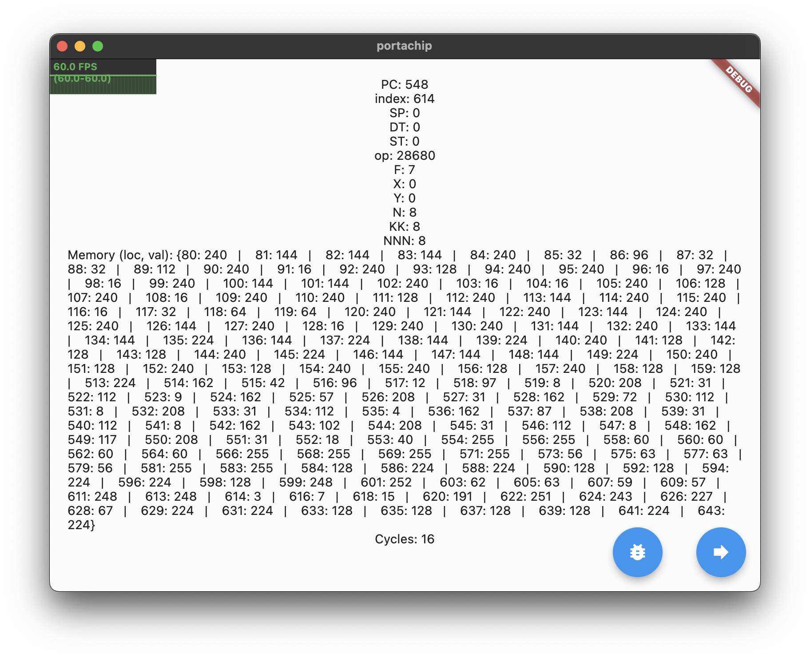

# PortaChip

An experimental cross-platform CHIP-8 interpreter built with Dart and Flutter. 

<p align="center">
  
</p>

**NOTE: The project is still not complete. There are some render issues and input does not work quite yet.**

## Introduction

CHIP-8 is an interpreted programming language, developed by Joseph Weisbecker. It was initially used on the COSMAC VIP and Telmac 1800 8-bit microcomputers in the mid-1970s. CHIP-8 programs are run on a CHIP-8 virtual machine. It was made to allow video games to be more easily programmed for these computers

There are a number of classic video games ported to CHIP-8, such as Pong, Space Invaders, Tetris, and Pac-Man. There are also applications like a random maze generator and Conway's Game of Life.

## Gallery

<p align="center">
  </img>
  </img>
  </img>
  </img>
  </img>
  </img>
</p>

The gallery above highlights iteration on development for the project.

## Contribute

For classes, use PascalCase. For variables and and methods, use CamelCase. Constants should be upper case.

Clone the project, checkout to a new branch, and submit a PR which will then be reviewed before being merged into master. A PR must address an issue. If there isn't one, create a new issue and mention it in your PR.

## Usage

1). Ensure that you have the [Flutter SDK](https://flutter.dev) installed and configured on your machine.

2). Clone this project and run ```flutter pub get``` to install dependencies.

3). To run on a device, run ```flutter run -d [your device]```.

## Credits

This is purely intended as a learning experience, so I am borrowing code and ideas from 
other resources:

- [Guide to Making a CHIP-8 Emulator](https://tobiasvl.github.io/blog/write-a-chip-8-emulator/#fetchdecodeexecute-loop)
- [How to write an emulator (CHIP-8 interpreter)](https://multigesture.net/articles/how-to-write-an-emulator-chip-8-interpreter/)
- [Wikipedia](https://en.wikipedia.org/wiki/CHIP-8#Virtual_machine_description)

Additional useful resources:

- [Bitwise Operations](https://en.wikipedia.org/wiki/Bitwise_operation)
- [Opcode](https://en.wikipedia.org/wiki/Opcode)

Packages used:

- flutter
- statsfl
- file_selector
- device_info_plus
- provider
- page_transition
- desktop_window
- path_provider

## License
PortaChip is licensed under GPL-3 [license](https://github.com/msoham123/PortaChip/blob/master/LICENSE) for more details
